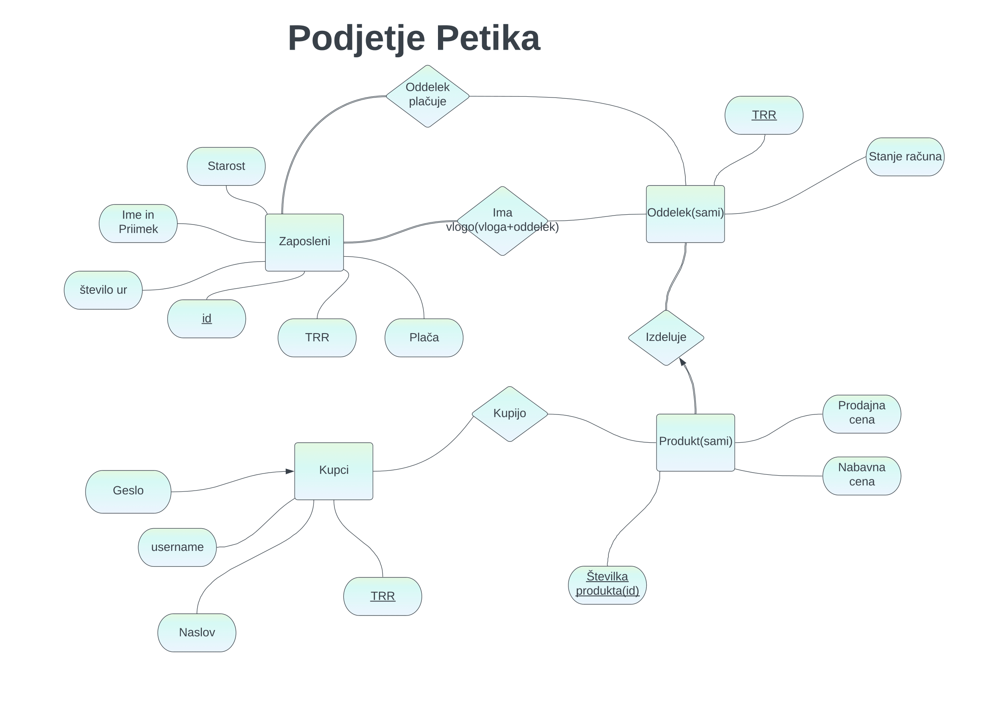

# OPB-projekt-UPT
Naredili bomo aplikacijo za spletno trgovino Petika, ki bo različnim uporabnikom dovolila različen dostop:
* Kupci bodo videli svoje nakupe ter dodali izdelke na svoj seznam,
* Zaposleni bodo lahko videli stranke ter dodajali izdelke (jih spreminjali),
* Šefi bodo imeli dostop do podatkov kupcov in zaposlenih, spreminjali pa bodo lahko podatke zaposlenih ter izdelke.

<!-- -->

Povezava do binderja:
https://mybinder.org/v2/gh/Petja-Murnik/OPB-projekt-UP/main?urlpath=proxy%2F8080

